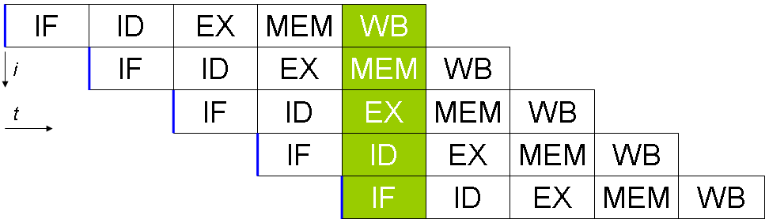

<style>
img[alt~="center"] {
  display: block;
  margin: 0 auto;
}
</style>

# АКОС: вводная лекция

---

# Организационная часть
* Лекции + семинары
* Оценка: `0.7*контесты + 0.3*коллоквиум + 0.1*летучки`


---
# Организационная часть: контесты
* Раз в две недели (иногда чаще)
* Логины и пароли раздадут на семинарах
* Работает антиплагиат
* Некоторые задачи будут требовать ревью от семинаристов

---
# Организационная часть: летучки
* Опрос по теме предыдущей лекции
* Иногда будет, иногда нет
* Летучки дают *бонус* (получить 10 можно без них)

---
# Организационная часть: коллоквиум
* Устный зачёт
* Нужно будет сдать «хоть что-то» = получить 0.1 балл
* Вопросы по задачам + вопросы на свободные темы


---
# Что такое операционная система?

---
# Что такое операционная система?
ОС — это абстракция, которая связывает различные компоненты компьютера и пользовательские программы

---
# Из каких компонент состоит компьютер?

---
# Из каких компонент состоит компьютер?
* Центральный процессор (CPU или ЦП)
* Чипсет и материнская плата
* Оперативная память (Random Access Memory = RAM)
* Накопители (HDD, SSD, NVMe)
* Аудиокарта
* Сетевая карта
* GPU
* Шина (PCI, I2C, ISA)

---
# Процессор
* Исполняет команды или _инструкции_
* Регистры – самая быстрые доступные ячейки памяти
* Регистры определяют раздрядность процессора
* Операндами могут быть либо константы, либо регистры, либо ссылки на память

---
# Оперативная память
* Random Access Memory
* Адресное пространство – непрерывный массив байт от 0 до $2^N$, где N – разрядность процессора (64 бита)
* В реальности процессоры на текущий момент обычно адресуют не более 48 бит (256 террабайт)
* Инструкции процессора расположены также в RAM – архитектура Фон-Неймана

---
# Немного ассемблера

```x86asm
mov rax, qword ptr [rax]
add rax, 2
mov rbx, 1
add rax, rbx
```

---
# Мультизадачность
* Мультизадачность – спобность системы исполнять несколько задач (процессов) одновременно
* Cooperative multitasking – процессы добровольно передают управление друг другу
* Preemptive multitasking – процессы вытесняются ОС каждые несколько миллисекунд

---
# Суперскалярность
* Параллелизм уровня инструкций
* Если две инструкции независимы друг от друга, их можно выполнить параллельно
* Каждая инструкция состоит из нескольких этапов: fetch, decode, execute, memory access, register write back
* CPU pipeline

---
# CPU pipeline


---
# Мультипроцессорность
* Тактовая частота процессоров не растёт примерно с 2005 года
* Поэтому современные процессоры обычно имеют несколько ядер
* *Планировщик (scheduler)* ОС для каждого ядра процессора в каждый момент времени решает какой процесс будет запущен
* Возникают проблемы синхронизации

---
# Системные вызовы
* Системные вызовы – это интерфейс операционной системы для процессов
* ABI = application binary interface
* SystemV ABI

---
# POSIX
* Portable Operating System Interface
* Стандарт, описывающий интерфейс операционных систем
* Системные вызовы – часть POSIX, но не всё
* Например, POSIX описывает как должна быть устроена файловая система

---
# libc
* Стандартная библиотека C
* Реализует системные вызовы в виде функций C
* Ещё куча всяких полезных функций :)
* Много реализаций, glibc одна из самых больших

---

```c
int res = read(0, &buf, 1024);
if (res < 0) {
    char* err = strerror(errno);
    // ...
}
```

---
# Файловые дескрипторы
* «Everything is a file!»
* Каждый файл имеет своё имя (или *путь*)
* Преобразовывать имя файла на каждый сисколл дорого
* Сначала нужно получить файловый дескриптор (например, через сисколл `open`)
* Все остальные операции без использования пути

---

# Спасибо!
