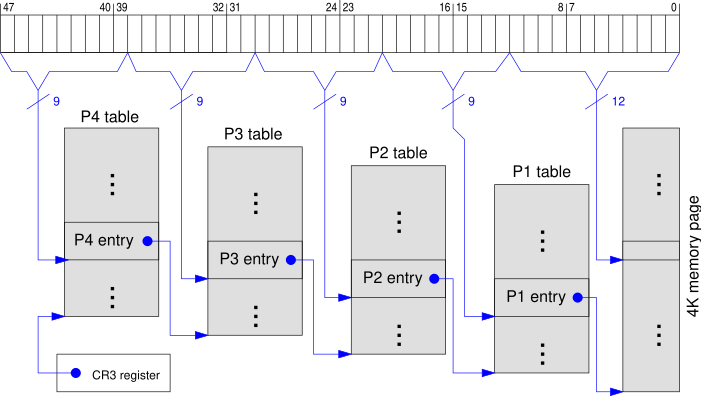

<style>
img[alt~="center"] {
  display: block;
  margin: 0 auto;
}
</style>

---

# Память

---

# Виртуальная память
* Как изолировать процессы друг для друга?


---

# Сегментная адресация
* Память делится на куски разного размера — сегменты
* За каждым процессом закрепляются несколько сегментов: сегмент с кодом, сегмент с данными, сегмент со стеком итд
* Фрагментация памяти в какой-то момент может быть ситуация, когда каждый второй байт занят и программа требует половину памяти; несмотря на то, что в реальности 50% памяти свободно, выделить её невозможно

---
# Страничная адресация
* Вся физическая память делится на ***фреймы*** — куски равного размера (4096 байт на x86)
* Каждому процессу выделяется своё *адресное пространство* или *виртуальная память*
* Виртуальная память делится на ***страницы*** аналогично фреймам
* Каждой страницы в адресном пространстве может соответствовать какой-то фрейм


---
# Страничная адресация
* Как хранить отображение страниц во фреймы?
* Всего существует $\frac{2^{64}}{2^{12}} = 2^{52}$ страниц памяти
* Если каждая страница описывается 8 байтами, то потребуется $2^{60}$ байт в памяти
* Нужен более экономный способ хранить это отображение

---
# Multi-level page tables
* Идея: давайте сделаем таблицы многоуровневыми — сначала поделим всё пространство на части, каждую из этих частей ещё на части итд
* Не храня лишние «дыры» мы будем экономить место
* Под x86 используются четырёхуровневые таблицы: P4, P3, P2, P1.
* Каждая таблица занимает ровно 4096 байт и содержит 512 записей (*PTE = page table entry*) по 8 байт
* Каждая запись ссылается на индекс в следующей таблице, последняя таблица ссылается на адрес фрейма

---
# Multi-level page tables


---
# Что хранится в PTE?
* Индексация следующей таблицы или фрейма не занимает все 8 байт PTE
* Кроме неё в PTE есть ещё специальные *флаги страниц*
* Например, 1-ый бит отвечает за то, будет ли страница доступна на запись
* 63ий — за то, будет ли процессор исполнять код на этой странице
* Также в некоторые биты процессор сам пишет флаги, например, dirty-бит устанавливается всегда, когда происходит запись в страницу
* Флаги имеют иерархическую видимость: если в P2 writeable-бит равен 0, а в P4 — 1, то страница будет доступна на запись

---
# Устройство виртуального адреса
* На текущий момент x86-64 позволяет адресовать 48 бит физической памяти
* Старшие биты (с 48 по 63) должны быть sign extended копии 47ого бита
* Следующие биты (с 38 по 47) адресуют PTE в P4
* Биты с 29 по 37 адресуют PTE в P3
* Биты с 21 по 28 адресуют PTE в P2
* Биты с 12 по 20 адресуют PTE в P1, которая ссылает непосредственно на фрейм
* Биты с 0 по 11 адресуют смещение внутри фрейма


---
# ОС и таблицы страниц
* Операционная система хранит таблицы страниц для каждого процесса
* Таблица страниц сменяется каждый раз, когда процессор переходит в другой поток
* В реальности каждое обращение к памяти не вызывает прыжки по таблицам, оно кэшируется в TLB (translation lookaside buffer)
* При переключении процесса TLB полностью сбрасывается

---
# Выделение памяти: on-demand paging
* Обычно современные ОС не выделяют всю запрошенную память сразу
* Page fault — ситуация, когда нет запрашиваемой страницы текущей таблице страниц
* Идея состоит в том, чтобы детектировать с помощью page fault'ов реальные обращения к памяти и только тогда её выделять

---
# Minor page fault
* Кроме самих таблиц страниц ОС обычно хранят свои отображения, запрошенные пользователем
* В Linux такие отображения называются `VMA = virtual memory area`
* Во время выделения памяти, ядро создаёт новый VMA
* При первом обращении происходит page fault, ядро выделяет фрейм и добавляет его в таблицу страниц
* Такой PF называют минорным (minor page fault)

---
# File memory mapping
* Кроме выделения памяти POSIX позволяет мапить файлы в память
* Можно указать файл, оффсет в нём и адрес памяти
* По этому адресу памяти в текущем пространстве будет лежать (изменяемая) копия файла
* Изменения в других процессах будут сразу отображены в память

---
# Major page faults
* За страницами, за которыми закреплён файл, скрывается механизм, который называется page cache
* Для них тоже используется on-demand paging: при первом обращении генерируется page fault, ядро перехватывает исключение, читает с диска файл и копирует его в память
* Такой PF называют мажорным (major page fault)

---
# Page cache
* Страницы с данными файла из всех процессов ссылаются на один и тот же фрейм
* Поэтому изменения файлов (в том числе через write) видны во всей ОС сразу
* Однако, write не гарантирует, что данные были записаны на диск

---
# fsync

```c
#include <unistd.h>

int fsync(int fd);
```

---


# mmap и munmap
```c
#include <sys/mman.h>

void* mmap(void* addr, size_t length, int prot, int flags, int fd, off_t offset);
int munmap(void* addr, size_t length);
int mprotect(void* addr, size_t len, int prot);
```

---
# mmap
* mmap выделяет область виртуальной памяти, начиная с адреса `addr` длиной `length` байт
* `prot` определяют *режим страницы*
* `flags` определяют *как* будет страница замапплена
* `fd` определяет какой файл будет стоять за выделенной областью
* `offset` — это оффсет файла, чтобы можно было mmap'ить куски

---
# mmap: prot
* `PROT_EXEC` — процессор сможет выполнять код на этой странице
* `PROT_READ` — страница будет доступна на чтение
* `PROT_WRITE` — страница будет доступна на запись
* `PROT_NONE` — к странице никак нельзя будет обратиться

---
# mmap: flags
* `MAP_ANONYMOUS` — определяет, что область будет анонимной, `fd == -1`
* `MAP_SHARED` — определяет, что область будет доступна детям текущего процесса
* `MAP_FIXED` — говорит ядру использовать *в точности* адрес `addr` или вернуть ошибку
* `MAP_POPULATE` — говорит ядру сразу выделить физическую память для этой области

---
# Псевдофайлы для контроля расхода памяти
* `/proc/<pid>/maps` хранит текущие VMA
* `/proc/<pid>/status` содержит статус процесса, есть куча информации о памяти
* `/proc/<pid>/mem` представляет собой память процесса (её можно читать и писать)
* `/proc/<pid>/map_files` хранит список файлов, которые замапленны в процесс

---
# Вытеснение страниц и swap
* Если системе не хватает физической памяти для хранения анонимных страниц, она начинает их сбрасывать на диск
* Вытеснение анонимных страниц происходит в специальный swap файл или раздел диска (файл подкачки)
* Обычно это никак не заметно на приложениях, однако в условиях memory pressure это может приводит к странным последствиям

---
# Вопросы?
