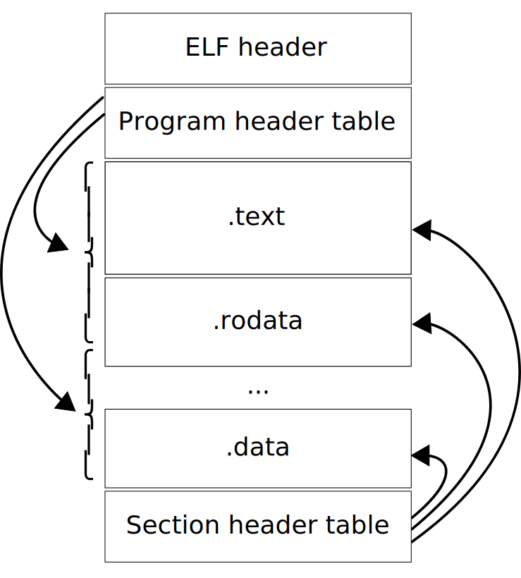

<style>
img[alt~="center"] {
  display: block;
  margin: 0 auto;
}
</style>

# Процессы

---

# ELF
* Executable & Linkable Format
* Исполняемый формат файлов для Linux
* Поддерживает разные архитектуры и битности
* [Спецификация](http://refspecs.linuxbase.org/elf/x86_64-abi-0.99.pdf)
* [Структуры внутри ядра](https://github.com/torvalds/linux/blob/master/include/uapi/linux/elf.h)

---

# ELF



---

# ELF: header

```c
typedef struct elf64_hdr {
  unsigned char  e_ident[EI_NIDENT];  /* ELF "magic number" */
  Elf64_Half e_type;
  Elf64_Half e_machine;
  Elf64_Word e_version;
  Elf64_Addr e_entry;    /* Entry point virtual address */
  Elf64_Off e_phoff;    /* Program header table file offset */
  Elf64_Off e_shoff;    /* Section header table file offset */
  Elf64_Word e_flags;
  Elf64_Half e_ehsize;
  Elf64_Half e_phentsize;
  Elf64_Half e_phnum;
  Elf64_Half e_shentsize;
  Elf64_Half e_shnum;
  Elf64_Half e_shstrndx;
} Elf64_Ehdr;
```

---

# ELF: секции
* Секции хранят непосредственно данные
* Каждая секция имеет своё имя
* Перечень всех секций хранит *таблица секций*

---


# ELF: section header

```c
typedef struct elf64_shdr {
  Elf64_Word sh_name;    /* Section name, index in string tbl */
  Elf64_Word sh_type;    /* Type of section */
  Elf64_Xword sh_flags;    /* Miscellaneous section attributes */
  Elf64_Addr sh_addr;    /* Section virtual addr at execution */
  Elf64_Off sh_offset;    /* Section file offset */
  Elf64_Xword sh_size;    /* Size of section in bytes */
  Elf64_Word sh_link;    /* Index of another section */
  Elf64_Word sh_info;    /* Additional section information */
  Elf64_Xword sh_addralign;  /* Section alignment */
  Elf64_Xword sh_entsize;  /* Entry size if section holds table */
} Elf64_Shdr;
```

---
# ELF: секции
* .data — данные
* .text — исполняемый код
* .rodata — read-only данные
* .symtab — таблица символов
* .strtab — таблица строк
* .shstrtab — таблица строк с названием секций
* .rel/.rela — таблица релокаций

---
# ELF: .symtab

```c
typedef struct {
    uint32_t      st_name;
    unsigned char st_info;
    unsigned char st_other;
    uint16_t      st_shndx;
    Elf64_Addr    st_value;
    uint64_t      st_size;
} Elf64_Sym;
```

---

# ELF: сегменты
* Все секции объединяются в *сегменты*
* Каждый сегмент имеет адрес, по которому он загружается
* Program header array содержит все сегменты, располагается в начале файла

---

# ELF: program header

```c
typedef struct elf64_phdr {
  Elf64_Word p_type;
  Elf64_Word p_flags;
  Elf64_Off p_offset;    /* Segment file offset */
  Elf64_Addr p_vaddr;    /* Segment virtual address */
  Elf64_Addr p_paddr;    /* Segment physical address */
  Elf64_Xword p_filesz;    /* Segment size in file */
  Elf64_Xword p_memsz;    /* Segment size in memory */
  Elf64_Xword p_align;    /* Segment alignment, file & memory */
} Elf64_Phdr;
```

---

# execve
* Парсит первые несколько байт файла
* Ищет ELF magic или shebang
* Загружает образ (mmap'ит)
* Подготавливает окружение для старта процесса (стэк, переменные окружения, etc)
* Запускает инструкцию по адресу `e_entry`

---

# Linux scheduler

---

# Realtime scheduling
* У каждого процесса есть собственный realtime приоритет
* Планировщик ищет процесс с наибольшим приоритетом и запускает его, пока он не выйдет
* Вытеснения нет!
* Round-robin для процессов с одним приоритетом

---

# Process niceness
* Значения от -20 до +19
* Процесс с меньшим niceness должен получать больше процессорного времени

---

# Timeslice
* Квант процессорного времени
* В зависимости от типа системы от 1 мс до 10-20 мс
* CPU bound процессы: в основном выполняют инструкции
* I/O bound процессы: в основном спят

---

# Timeslice & niceness
* Зададим каждому приоритету определённый timeslice (например, 0 = 100 ms, +20 = 5 ms)
* Процессы с меньшим NI получают больше процессорного времени

---
# Timeslice & niceness: проблемы подхода
* Два процесса с NI = +19 и два процесса c NI = 0
* Первые получают по 5 ms процессорного времени
* Вторые по 100 ms
* В обоих случаях 50% CPU, но переключения контекста у первых происходит чаще

---
# Timeslice & niceness: проблемы подхода
* Два процесса NI = 0 и NI = 1 vs два процесса NI = +18 и NI = +19
* `5ms/10ms` vs `95ms/105ms`
* Нелинейность относительно стартового значения

---

# Completly Fair Scheduler
* Эмулирует идеальный multitasking процессор
* Идея – раздавать процессам время пропорциональное 1/N, где N – количество запущенных процессов
* Каждому процессу начисляется `vruntime` – количество затраченного CPU времени за определённый интервал времени
* Очередным берётся процесс с наименьшим `vruntime`

---
# CFS: проблемы
* Минимальное время (гранулярность) => чем больше процессов, тем менее честным становится CFS
* Context switch считается zero-time операцией, но по факту это не так

---

# Вопросы?
