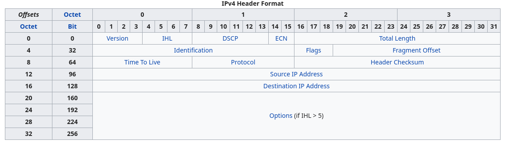
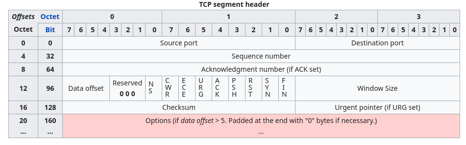

<style>
img[alt~="center"] {
  display: block;
  margin: 0 auto;
}
</style>

# Networking, part 1

---

# Модель OSI

---

# Протоколы
* Современные сети строятся на основе *протоколов*
* Каждый протокол – абстракция над другим протоколом (более низким) для решения какой-то проблемы
* Поэтому иногда говорят *стек протоколов*

---


# Модель OSI
OSI разделяет современные протоколы на 7 уровней:
* Layer 1: Physical layer
* Layer 2: Data link layer
* Layer 3: Network layer
* Layer 4: Transport layer
* *(тут немного пропустим)*
* Layer 7: Application layer

---


# Модель OSI: physical layer
*Как данные будут переданы через физическую среду?*

Протоколы:
* Bluetooth
* Ethernet physical layer: Ethernet over twisted pair, Fast Ethernet, Gigabit Ethernet, ...
* IEEE 802.11g/b/n

---

# Link layer
*Как копьютеры могут общаться в локальной сети?*

* Обеспечивает обмен данными между узлами в одной сети LAN (local area network)
* Обычно на этом уровне протоколы оперируют пакетами (например, 1500 байт для Ether)
* На этом уровне появляется канальный адрес (link address), например, MAC-адрес

---


# Network layer
*Как объединить локальные сети?*

* Обеспечивает связь между разными LAN
* На этом уровне появляется сетевой адрес (например, IP адрес)
* Появляется понятие *маршрутизации*
* Основной протокол – Internet Protocol (IP)

---

# Transport layer
*Как обеспечить обмен данными между приложениями?*

* Используется для передачи данных между различными приложениями на узлах сети
* Используются *порты*, чтобы разделять приложения на концах маршрутов
* Примеры: TCP, UDP, SCTP

---

# Application layer
*Как каждое конкретное приложение обменивается данными?*

* Протоколы приложений (веб-браузеры, почтовые клиенты, игры)
* Один из самых известных – HyperText Transfer Protocol (HTTP)
* Почтовые протоколы – SMTP, POP3
* Secure Shell (SSH)

---

# Ethernet
* Совокупность стандартов (IEEE 803.2), описывающих разные протоколы physical и link layer
* Передача между устройставми осуществляется с помощью фреймов
* Каждое устройство имеет свой MAC-адрес
* Ethernet – это point-to-point протокол, используются коммутаторы (или свитчи) для построения full-mesh сети
* Свитч имеет таблицу всех подключённых клиентов и форвардит фреймы в соответствии с ней
* `FF:FF:FF:FF:FF:FF` – специальный *broadcast* адрес

---

# Internet Protocol
* Протокол для объединения LAN
* Две версии: IPv4 vs IPv6
* IPv4 широко распространён, IPv6 только начинает появляться

---
# IP адреса
* IPv4 адрес состоит из 32 бит (для IPv6 – 128)
* Обычно записывается в виде 4 октетов (4 байт) через точку: 8.8.8.8

---
# Маска подсети
* Множество IP-адресов с одинаковым *префиксом*
* Маска подсети: `255.0.0.0`
* CIDR-нотация: `10.0.0.0/8`
* Private subnets: `10.0.0.0/8`, `127.0.0.1/8`, `192.168.0.0/16`

---

# IP: маршрутизация
* Не все узлы сети связаны напрямую $\Rightarrow$ давайте передавать данные через другие узлы
* Передача между соседними узлами в IP-сети называется прыжком или хопом (hop)
* Каждый узел сети имеет *таблицу маршрутизации*
* Эта таблица содержит маски подсетей и *gateway* – узел, куда нужно переслать данные

---

# ARP
* Address Resolution Protocol
* Определяет MAC-адрес по IP
* Рассылается broacast пакет «Who has 10.0.0.2? Tell 10.0.0.1»
* Все хосты проверяют свой IP и если он совпадает, отсылают «10.0.0.2 is at XX:XX:XX:XX:XX:XX»
* ARP spoofing

---

# IP: маршрутизация
* AS – это система IP-сетей и маршрутизаторов, управляемых одним или несколькими операторами, имеющими единую политику маршрутизации с Интернетом ($\copyright$ Wiki)
* Блоки подсетей выдаются автономным сетям
* Точка обмена трафиком – точки обмена трафиком между разными AS
* Одна из самых крупных в Европе и России – MSK-IX

---

# IPv4: устройство пакета


---

# IP: TTL
* TTL – tive-to-live
* Байт, который описывает максимальное количество прыжков в сети
* Если очередной хост уменьшил TTL до нуля, то пакет просто дропается, а отправителю посылается специальное сообщение по протоколу ICMP (TTL exceeded)
* На основе этого поведения работает trecroute/tracepath


---

# IP: проблемы
* Не гарантирует доставку данных (packet loss)
* Не гарантирует порядок доставки (packet reordering)
* Не гарантирует, что пакет будет отправлен лишь один раз (packet duplication)
* Непонятно как реализовывать multitenancy IP протокола – нельзя всем приложениям рассылать все IP-пакеты

---

# BGP
* Как операторам AS обновлять маршруты?
* Border gateway protocol
* Устанавливается между BGP-роутерами соседних AS
* Каждая AS анонсирует свои префиксы (подсети)
* Изменения распространяются по всему интернету
* Выбирается самый «короткий» маршрут
* Таблица маршрутизации Интернета очень большая: на текущий момент 900k+ префиксов

---

# TCP
* Вводит понятие *порта* приложения – адрес получателя на IP-узле
* Обеспечивает надёжную доставку данных (reliable delivery)
* Обеспечивает порядок доставки и дедупликацию данных
* Connection-oriented – приложения должны установить полнодуплексное *соединение*
* Data stream – данные передаются не отдельными пакетами, а непрерывным потоком
* Также обеспечивает congestion control и flow control

---

# TCP: устройство пакета


---

# TCP: 3-way handshake
Хендшейк – механизм установки соединения. Выполняется в три этапа:

1. Инициатор соединения (клиент) посылает пакет с флагом **SYN** серверу
1. Сервер посылает пакет с флагами **SYN** и **ACK** клиенту, а также *sequence number*, с которого будут нумероваться все остальные байты
1. Клиент посылает **ACK**

---

# TCP
* Transmission Control Protocol
* Отправитель посылает пронумерованные пакеты, что позволяет реконструировать правильную последовательность при переупорядочивании
* Принимающий в ответ отправляет «одобрения»: «принято всё до номера N»
* Если пакет теряется, то acknowledgment (ACK) долго не приходит, отправитель перепосылает пакет
* Если пришёл повторный ACK, то отправитель тоже перепосылает пакет

---

# UDP
* User Datagram Protocol
* Не даёт никаких гарантий
* Пересылка осуществляется через пакеты (UDP datagrams)
* Используется там, где неважна последовательность пакетов (например, онлайн игры или торренты)
* Или там, где потеря/переупорядочивание/дублирование не сильно сказывается (например, звонки)

---


---

# DNS
* Позволяет преобразовывать человекочитаемые доменные имена в IP-адреса
* Работает поверх UDP, стандартный порт – 53
* Корневые сервера обслуживают все запросы DNS в интернете
* Результат кэшируется и имеет время жизни, заданное в ответе DNS (TTL)
* Корневые сервера спускаются к более мелким DNS серверам (например, к .ru)
* Более мелкие могут спускаться дальше итд – recursive resolving

---

# DNS: виды записей
* **A** запись: имя -> IPv4 адрес
* **AAAA** запись: имя -> IPv6 адрес
* **NS** запись: имя -> авторитетный DNS-сервер
* **CNAME** запись: имя -> имя

---

# HTTP
* HyperText Transport Protocol
* L7 протокол
* Запрос-ответ: клиент отправляет запросы, сервер возвращает ответами
* Человеко-читаемый
* Для перевода строк служит \r\n

---

# HTTP: запрос
* Метод: GET, POST, DELETE, PUT, OPTIONS, HEAD
* Uniform Resource Identifier (URI) – путь запроса
* Версия HTTP
* Заголовки
* Тело (опционально)

---

# HTTP: запрос
```
POST /cgi-bin/process.cgi HTTP/1.1
User-Agent: Mozilla/4.0 (compatible; MSIE5.01; Windows NT)
Host: www.tutorialspoint.com
Content-Type: application/x-www-form-urlencoded
Content-Length: length
Accept-Language: en-us
Accept-Encoding: gzip, deflate
Connection: Keep-Alive

licenseID=string&content=string&/paramsXML=string
```

---
# HTTP: ответ
* Версия HTTP
* Код (статус) ответа
* Расшифровка ответа (reason)

---

# HTTP: ответ
```
HTTP/1.1 404 Not Found
Date: Sun, 18 Oct 2012 10:36:20 GMT
Server: Apache/2.2.14 (Win32)
Content-Length: 230
Connection: Closed
Content-Type: text/html; charset=iso-8859-1
```

---

# HTTP: статус коды
* **1xx** – информационные
* **2хх** – успешные коды (например, 200 OK)
* **3xx** – для перенаправлений пользователей (редиректы)
* **4xx** – ошибка клиента (неправильный адрес, некорретный запрос)
* **5xx** – ошибка сервера (внутреняя ошибка, сервис временно недоступен)


---

# Вопросы?
