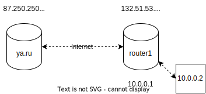
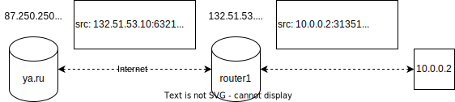
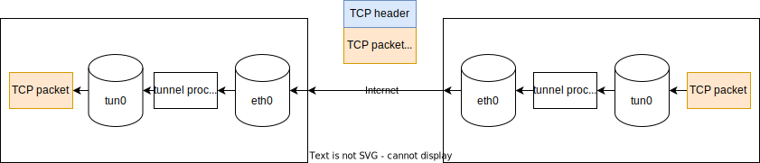

# Networking, part 2

---

---
# NAT
* Network address translation
* По определённым правилам преобразует source/destination в IP-пакете (SNAT/DNAT)

---

---
# Full-cone NAT
* `(INT_ADDR, INT_PORT) <=> (EXTERNAL_ADDR, INT_PORT, *, *)`
* В обратную сторону пакеты будут направляться от любых пар адрес-порт
* Port forwarding

---

# (Address-)restricted-cone NAT
* `(INT_ADDR, INT_PORT) <=> (EXTERNAL_ADDR, INT_PORT, REM_ADDR, *)`
* В обратную сторону пакеты будут направляться, если клиент уже открывал соединение до сервера

# Port-restricted-cone NAT
* `(INT_ADDR, INT_PORT) <=> (EXTERNAL_ADDR, INT_PORT, REM_ADDR, REM_PORT)`
* В обратную сторону пакеты будут направляться, если клиент уже открывал соединение до сервера до определённого порта

---

# Symmetric NAT
* `(INT_ADDR, INT_PORT) <=> (EXT_ADDR, EXT_PORT, REM_ADDR, REM_PORT)`
* `EXT_PORT` выбирается случайным образом

---

# NAT traversal
* Проблема: два клиента за NAT хотят установить соединение, как это сделать?
* Для этого используется внешний сервер с общедоступным адресом, который определяет типы NAT'ов
* В зависимости от типов NAT, можно сделать hole punching или нельзя (например, symmetric + symmetric)
* Если NAT traversal возможен (full-cone + restricted-cone), то используется STUN
* Если NAT traversal сделать невозможно, используются выделенные сервера-прокси (TURN)

---

# [Невероятно подробная статья про NAT](https://tailscale.com/blog/how-nat-traversal-works/)

---

# Как это устроено в Linux: devices
* *Интерфейс* или *устройство* (interface/device) — сущность в ядре, обычно: сетевая карта или loopback интерфейс
* Устройство имеет свой уникальный link-layer address (MAC)
* `ip link`
* Каждое устройство может также иметь несколько network адресов (IP + маска подсети)
* `ip addr`

---
# Как это устроено в Linux: routing tables
* Несколько таблиц маршрутизации (пользователь может задавать вплоть до 252 таблиц)
* `ip route show table <table name>`
* Две встроенные: local и main
* local описывает локальные адреса интерфейсов (которые приземляются на этом же хосте)
* main описывает основную таблицу маршрутизации
* `ip rule`

---

# DHCP
* Адреса интерфейсов можно назначать вручную, однако это неудобно
* DHCP = Dynamic Host Configuration Protocol
* В IPv6 DHCP заменён SLAAC (Stateless address autoconfiguration)

---

# DHCP: DORA

---

# Netfilter
* Подсистема Linux для перехвата, мониторига и изменения пакетов сетевого стека
* Состоит из правил, которые разбиты на таблицы и цепочки (chains)

---

---

# Таблицы Netfilter

## conntrack
* Stateful firewall
* Позволяет заглядывать внутрь TCP-соединений
* Например, можно парсить первые несколько байт соединения и оверрайдить dstPort в таких пакетах

## mangle
* Таблица, в которой можно менять некоторые поля в заголовке IP-пакета
* Например, TTL или помечать специальной меткой (MARK), чтобы в дальнейших правилах её учитывать

---

# Таблицы Netfilter

## nat
* Таблица для SNAT/DNAT/MASQUERADE правил

## filter
* Таблица для фильтрации пакетов
* Здесь можно, например, просто выбросить пакет, который пришёл от определённого адреса

---

# `iptables`
* CLI для управления netfilter
* `iptables -A INPUT -s 8.8.8.8 -j DROP`
* `iptables -t nat -A POSTROUTING -o eth0 -j SNAT --to 192.168.1.1`
* Более современные аналоги: `nftables`, `ufw`

---

# [Как создать разные типы NAT с помощью iptables](https://stackoverflow.com/questions/11719572/how-to-simulate-different-nat-behaviours)

---

# iptables под капотом: ioctl vs AF_NETLINK
* Устаревший способ: `ioctl` для конфигурирования сети (`man 7 netdevice`)
* Современный способ: семейство протоколов `AF_NETLINK`
* `fd = socket(AF_NETLINK, socket_type, netlink_family);`
* `netlink_family` может быть разным:
* * `NETLINK_ROUTE` для замены netdevice (`man 7 rtnetlink`)
* * `NETLINK_NETFILTER` для операций с netfilter

---

# Туннелирование
* Создание «туннеля» между двумя точками через другие сети
* Пакет, который проходит через туннель, помещается (инкапуслируется) в другой пакет, который уже идёт по сети
* Примеры: IPIP туннелирование, GRE (generic routing encapsulation)

---

# Userspace tunneling
* Для туннелирования обычно нужно написать свой модуль в ядро
* TUN/TAP interfaces
* Пакеты отправляются в tun/tap-интерфейс, оттуда пользовательский процесс их получает и отправляет по сети через другой интерфейс, на другом действия выполняются в обратном порядке

---

# Userspace tunneling

---

# Вопросы?
