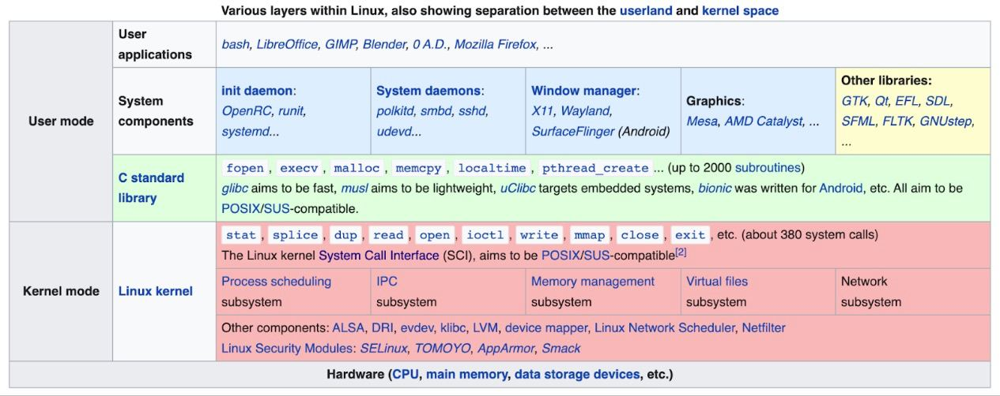
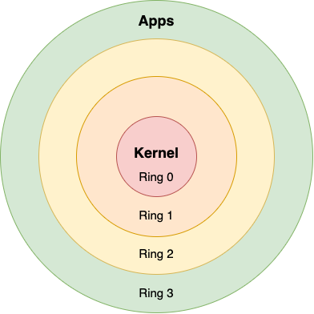
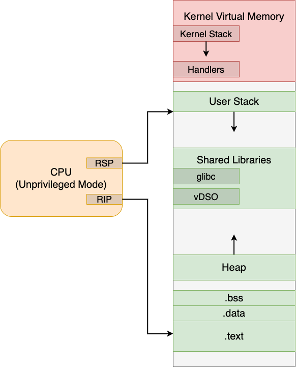
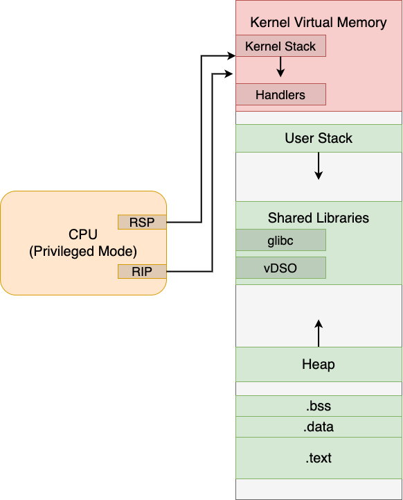
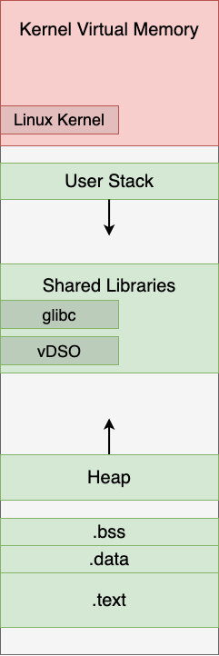

# System Calls

---

# Зачем нужны системные вызовы?

Операционная система делает следующее:
* Управляет ресурсами устройства
* Строит и предоставляет абстракции для каких-то осмысленных действий с использованием этих ресурсов
    * Примеры: работа с файлами или процессами, ввод и вывод данных

Системный вызов - это способ попросить ядро выполнить для нас определённое действие
* Набор системных вызовов - это интерфейс, который предоставляет нам операционная система
* Чем богаче этот интерфейс, тем больше у операционной системы возможностей

---

# Примеры системных вызовов POSIX

Управление процессами: `fork`, `waitpid`, `exec`, `exit`, `kill`

Управление файлами: `open`, `close`, `read`, `write`, `lseek`, `stat`

Управление каталогами и файловой системой: `mkdir`, `rmdir`, `link`, `unlink`, `mount`, `unmount`, `chdir`, `chmod`

Управление памятью: `brk`, `mmap`, `munmap`

Работа с сетью: `socket`, `bind`, `connect`, `listen`, `accept`

_Примечание:  одноимённые функции являются обёрткой над настоящими вызовами_

---

# Безопасность

Операционная система также обеспечивает и безопасность:

* Процессы изолированы друг от друга (IPC реализовано средствами самой ОС)

* Пользовательские процессы не имеют прямого доступа к железу и работают в _непривилегированном_ режиме CPU

* Операционная система имеет прямой доступ к железу и работает в _привилегированном_ режиме CPU

* Системные вызовы позволяют пользовательским процессам выполнить нужный им код из ядра (конечно, если ОС не против)

---

# User Space & Kernel Space

---

# Protection Rings

Описывают упомянутые выше уровни привилегий

Реализуются средствами CPU: в зависимости от уровня привилегий доступны разные наборы инструкций

Linux, macOS и Windows используют только два уровня

---

# Как происходит системный вызов?

---

# Исходная позиция

Рассмотрим виртуальное адресное пространство нашего процесса, а также процессор, на котором он исполняется

Пусть в тексте программы происходит вызов какой-то библиотечной функции, тогда:

* Производим действия в соответствии с Calling Conventions
* Выполняем инструкцию `call`

---

# Инструкция `syscall`

Как мы уже знаем, взаимодействие с ОС выражется через системные вызовы, пусть мы дошли до одного из них

С точки зрения инструкций это будет выглядеть так:

* Кладём в регистры номер системного вызова и аргументы

* Выполняем инструкцию `syscall`

---

# Обработка системного вызова

Что происходит дальше:

* Пользовательские страницы защищаются от чтения, записи и исполнения

* CPU переходит в привилегированный режим

* Пользовательский стек заменяется на стек ядра, сохраняется контекст

* Происходит поиск обработчика в заранее заполненной `System Calls Table`

---

# Обработка системного вызова

* Если обработчик найден, то выполняем его код, иначе сразу переходим к следующему шагу

* Выполняется инструкция `sysret`, всё возвращается в состояние до выполнения `syscall`

* Переходим к следующей инструкции

---

# Часто используемые системные вызовы

Существует класс системных вызовов, которые используются только для получения какой-то информации, причём и в User Space, и в Kernel Space результат выполнения будет одинаковым (например, `gettimeofday`)

Для них существует оптимизация под названием `vDSO`

---

# Virtual Dynamic Shared Object (vDSO)

Особая динамическая библиотека, автоматически отображаемая ядром в виртуальное адресное пространство каждого процесса

Содержит в себе реализации описанных выше системных вызовов

Исполнение происходит в User Space, не требует перехода в режим ядра, а значит увеличивает производительность

---

# Финиш

Таким же образом выполяются и все остальные системные вызовы внутри вызванной нами функции

В конце мы возвращаемся к нашей программе и продолжаем её выполнение

---

# Shared Libraries

---

# Библиотеки

Мы можем создавать исполняемый код, который будут использовать другие программы

Для этого нам нужно создать библиотеку:
* Статическую (`Static`)
    * `$ gcc -c -fPIC -o libcaos.a libcaos.c`
  
* Или разделяемую (`Shared`)
    * `$ gcc -shared -fPIC -o libcaos.so libcaos.c`

Флаг `-fPIC` говорит о том, что полученный код будет позиционно независимым

---

# Разделяемые библиотеки

Существует два способа использовать разделяемую библиотеку:

* `Dynamic Linking` - динамическая линковка. При запуске программы будет произведён поиск зависимостей и дальнейшее разрешение неизвестных адресов

* `Dynamic Loading` - разделяемые библиотеки можно загружать прямо во время работы программы с помощью `libdl`

Использование разделяемых библиотек позволяет уменьшить размер исполняемых файлов, однако требует наличия этих библиотек у конечного пользователя

---

# Address Space Layout Randomization (ASLR)

Ряд эксплойтов опирается на то, что некоторые участки кода загружаются в одни и те же места

В целях безопасности существует механизм `ASLR`, который должен противостоять таким атакам путём рандомизации загрузки ключевых частей адресного пространства

В Linux текст программы, куча, разделяемые библиотеки и даже ядро (`kASLR`) загружаются со случайным смещением

---

# Q&A
